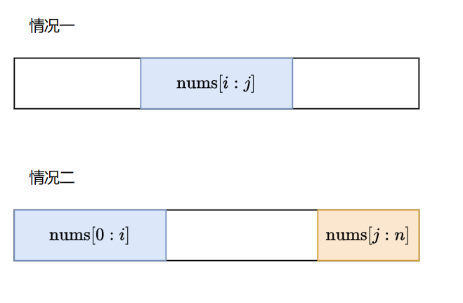

### 918. 环形子数组的最大和
给定一个长度为 n 的环形整数数组 nums ，返回 nums 的非空 子数组 的最大可能和 。

环形数组 意味着数组的末端将会与开头相连呈环状。形式上， nums[i] 的下一个元素是 nums[(i + 1) % n] ， nums[i] 的前一个元素是 nums[(i - 1 + n) % n] 。

子数组 最多只能包含固定缓冲区 nums 中的每个元素一次。形式上，对于子数组 nums[i], nums[i + 1], ..., nums[j] ，不存在 i <= k1, k2 <= j 其中 k1 % n == k2 % n 。

### 示例 1：
    输入：nums = [1,-2,3,-2]
    输出：3
    解释：从子数组 [3] 得到最大和 3

### 示例 2：
    输入：nums = [5,-3,5]
    输出：10
    解释：从子数组 [5,5] 得到最大和 5 + 5 = 10

### 示例 3：
    输入：nums = [3,-2,2,-3]
    输出：3
    解释：从子数组 [3] 和 [3,-2,2] 都可以得到最大和 3

### 思路：

    我们把子数组分为如图两种情况
    第一种情况：动态规划可以得出答案 dp[i] = Math.max(dp[i - 1] + nums[i], nums[i])
    第二种情况：从右往左便利找到两端相加最大的

### 代码：
    var maxSubarraySumCircular = function(nums) {
        let n = nums.length
        let dp = new Array(n).fill(0)
        let res = nums[0]
        let leftMax = []
        let leftSum = nums[0] // [0，i]相加的结果
        leftMax[0] = nums[0] // [0,i]最大的结果
        dp = nums[0]
        for(let i = 1; i < n; i++){
            dp = Math.max(nums[i], dp + nums[i])
            res = Math.max(res, dp) // 动态规划找出第一种情况的最大值
            leftSum += nums[i] // 当前[0,i]的值
            leftMax[i] = Math.max(leftMax[i - 1], leftSum) // 左边[0,i]的最大值
        }

        // 计算第二种情况
        let rightSum = 0
        for(let i = n - 1; i > 0; i--){
            rightSum += nums[i]
            res = Math.max(res, rightSum + leftMax[i - 1])
        }
        return res
    };
