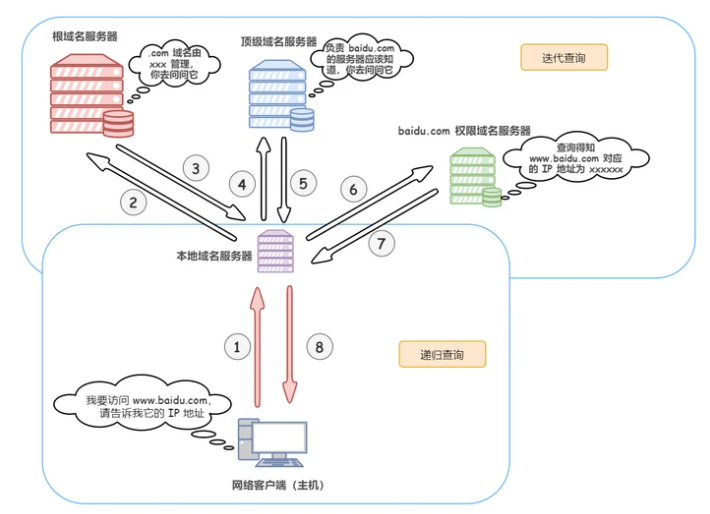

#### DNS
    dns(域名系统)是将域名和对应IP地址进行转换的服务器，简单来说就是把域名翻译成IP地址

    IP地址：一长串能够唯一地标记网络上的计算机的数字
    域名：是由一串用点分隔的名字组成的 Internet 上某一台计算机或计算机组的名称，用于在数据传输时对计算机的定位标识

    查询过程：
    1.首先会查找浏览器的DNS缓存
    2.如果没命中，则查找操作系统中的DNS缓存
    3.如果没命中，则查找本地域名服务器的DNS缓存(递归)
    4.如果没命中，则向上级域名服务器迭代查询
        一、本地域名服务器向根域名服务器查询，根域名服务器返回管理当前域名的顶级域名服务器地址
        二、本地域名服务器向对应的顶级域名服务器查询，顶级域名服务器返回管理当前域名的权限域名服务器地址
        三、本地域名服务器向对应的权限域名服务器查询，权限域名服务器返回当前域名的IP地址
    5.本地域名服务器拿到IP地址后返回给操作系统并缓存IP地址
    6.操作系统拿到IP地址后返回给浏览器并缓存IP地址
    7.浏览器拿到IP地址并缓存
