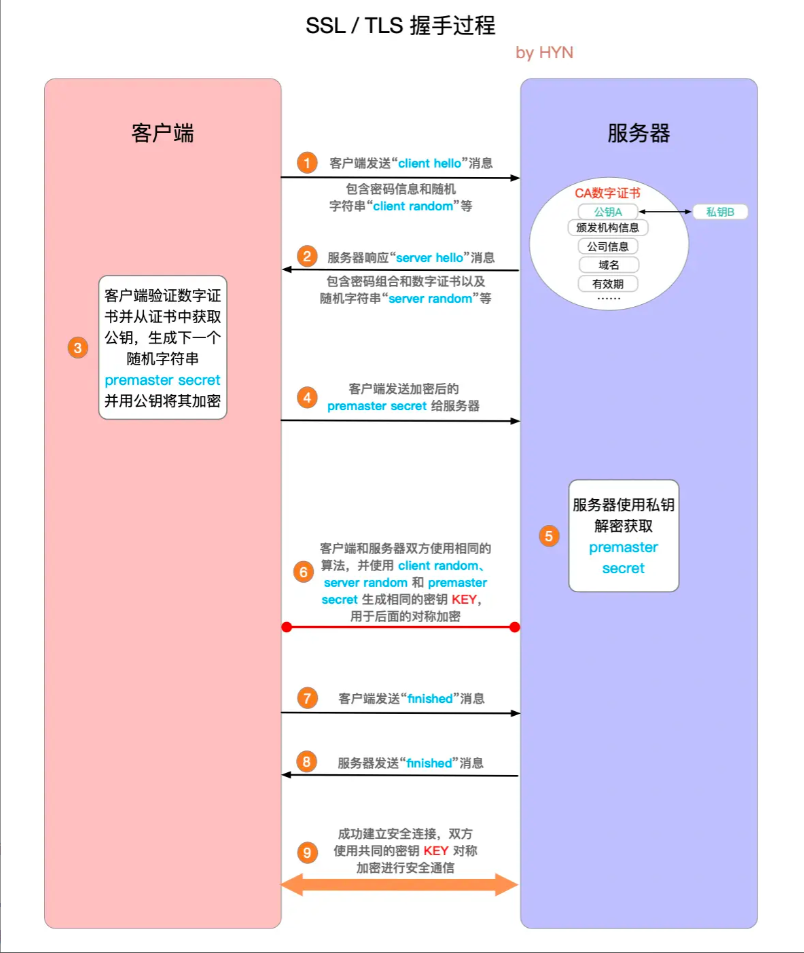

#### HTTP
    概念：超文本运输协议，是实现网络通信的一种规范
        在实际应用中，HTTP常被用于在Web浏览器和网站服务器之间传递信息，以明文方式发送内容，不提供任何方式的数据加密。
    
    特点：
    1.支持客户/服务器模式
    2.简单快速：请求只需要传请求方法和路径
    3.灵活：可以传任意类型的数据，传输类型通过content-type标记
    4.无连接：每次连接只处理一个请求，请求处理完毕就马上断开连接
    5.无状态：http不会保存上一次的状态(因此有了cookie、session、token) 

#### HTTPS
    概念：HTTPS = HTTP + SSL/TLS
        因为http是以明文的方式发送内容，导致数据不安全。所以https就是为了解决http不安全的问题。SSL/TLS就是为浏览器和服务器之间的通信进行加密的。
    
    SSL/TLS(安全套接字协议)如何进行加密：
        主要依赖三种手段：对称加密、非对称加密、数字证书

    1.对称加密：
        客户端和服务器约定好用同一个密钥来对消息进行加密和解密。
        缺点：因为共享一个密钥，所以密钥容易泄露
    
    2.非对称加密：
        客户端和服务器分别拥有一个公钥和一个私钥，公钥可以对外暴露，私钥只能自己知道。使用公钥加密的消息只有私钥才能解密。然后客户端和服务器交换公钥，客户端用服务器的公钥加密消息，服务器收到消息后用自己的私钥解密。
        优点：使得私钥的泄露风险降低
        缺点：因为非对称加密需要拿到对方的公钥，所以在交换公钥的时候可能会被中间人换成自己的公钥，这样客户端拿到的都是中间人的公钥，客户端用中间人的公钥加密发送消息，中间人可以用自己的私钥解密并篡改消息再用服务器的公钥加密发送给服务器，服务器收到的消息就是错误的。

    3.数字证书：
        向权威机构申请数字证书来解决非对称加密中公钥来源的不安全性。
        流程：
        一、首先拿本地生成的公钥和其他信息(比如说企业名称什么的)去认证中心申请数字证书。
        二、认证中心拿到这些信息后会选择一种单向hash算法(单向hash算法的特点是不可逆的，所以只要原始内容改变了，加密后的结果就不一样了，这样就防止了内容被篡改)进行加密，加密后的东西我们称之为摘要。
        三、生成摘要后认证中心在用自己的私钥进行加密，加密后的结果称之为数字签名
        四、最后认证中心把申请信息(包含公钥)和数字前面整合在一起，生成数字证书，然后把数字证书返回给我们。

        使用：服务器拿到数字证书后把证书发送到客户端，客户端拿到证书后需要用认证中心的公钥去解密数字签名(我们的电脑和浏览器内置了一部分权威机构的根证书，这些证书包含了认证中心的的公钥)，客户端解密后拿到摘要，然后会用认证中心相同的hash算法将申请信息生成一份摘要，两份摘要进行对比，一样则证明没有被篡改，客户端就可以保证拿到服务器的公钥。
    
    SSL/TLS流程：
        一、客户端发起通信请求并发送一个随机字符串、客户端支持的加密算法、ssl支持的版本等
        二、服务器申请数字证书，然后响应客户端并给客户端返回确认的加密算法、确认的ssl版本、数字证书、一个随机字符串
        三、客户端解密数字证书拿到服务器的公钥，然后生成一个随机字符串并用服务器的公钥加密发送给服务器
        四、服务器用私钥解密拿到随机的字符串
        五、客户端和服务器使用约定好的加密算法加密之前的三个随机字符串，得到相同的密钥用于对称加密
        六、客户端发送用共享密钥加密的“finished”信号
        七、服务器发送用共享密钥加密的“finished”信号
        八、使用对称加密进行通信

